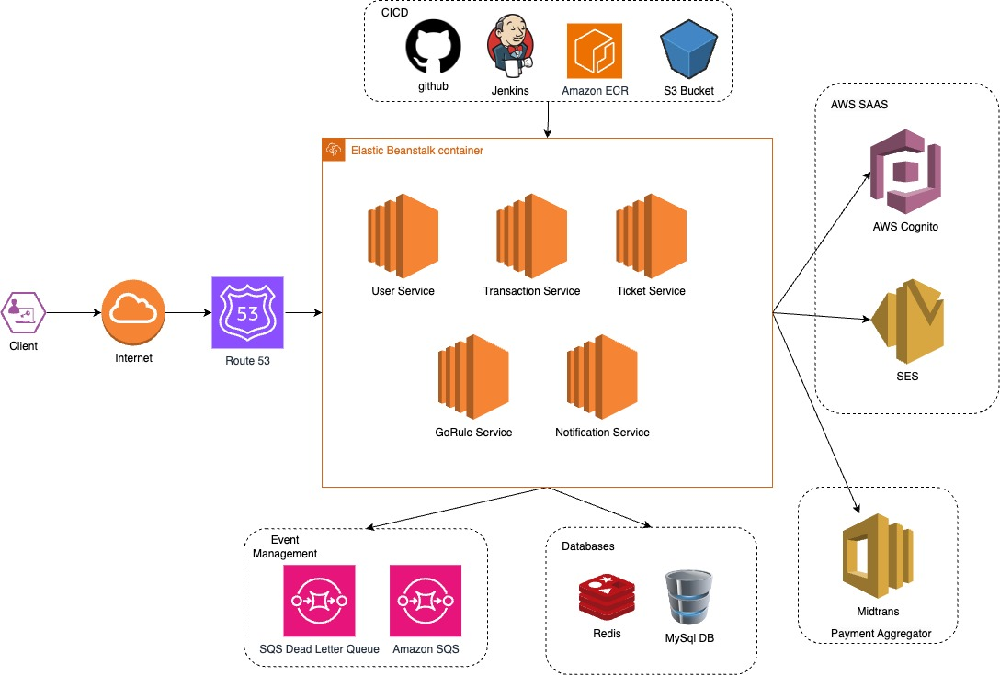
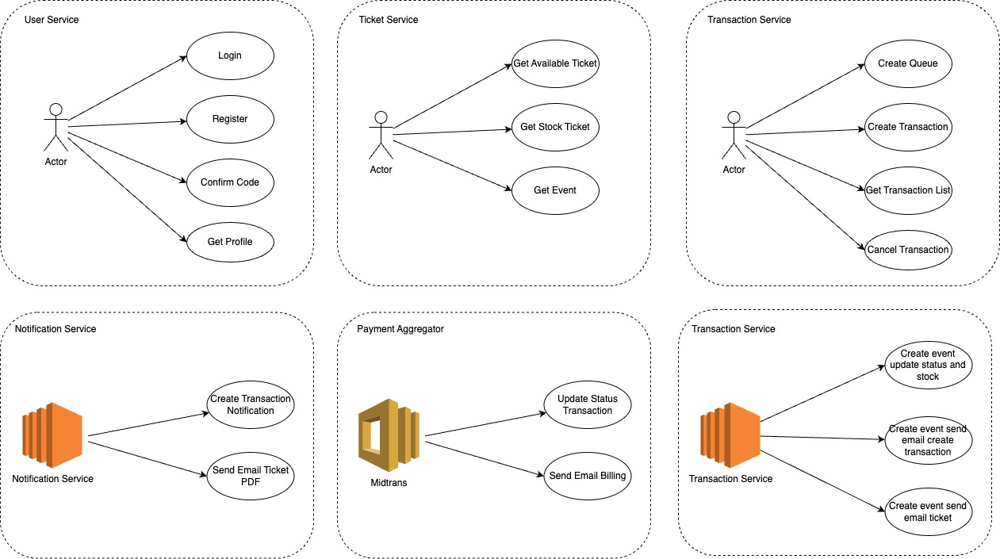
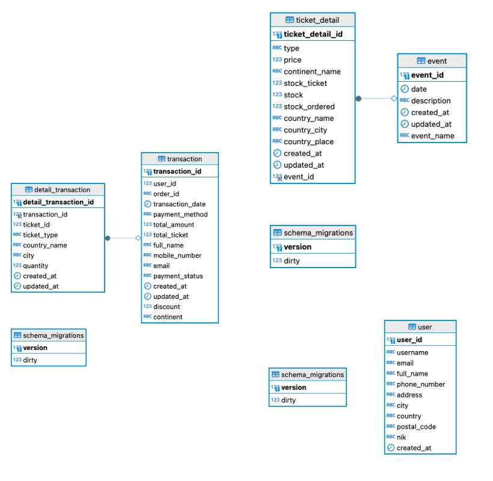

# GoRule Service

## Name

grule-service

## Description

GoRule Service is service that used bisnis rule management

## Installation

1. Ensure, already install golang 1.21 or up
2. Create file .env

```bash
    cp env_example .env
```

3. Fill out the env configuration

```bash
# APP
APP_PORT=
```

4. Install dependencies:

```bash
make install
```

5. Run in development:

```bash
make run
```

## Test

1. Run unit test

```bash
make unit-test
```

2. Show local coverage (in html)

```bash
make coverage
```

## High Level Design Architecture



## Low Level Design Architecture



## ERD



## Authors

- **Syamsul Bachri** - [Github](https://github.com/SyamSolution)

## Development Tools

- [Fiber](https://gofiber.io/) Rest Framework
- [Zap](https://github.com/uber-go/zap) Log Management
- [Go mod](https://go.dev/ref/mod) Depedency Management
- [Docker](https://www.docker.com/) Container Management
- [Amazon SQS](https://aws.amazon.com/sqs/) Event Management
